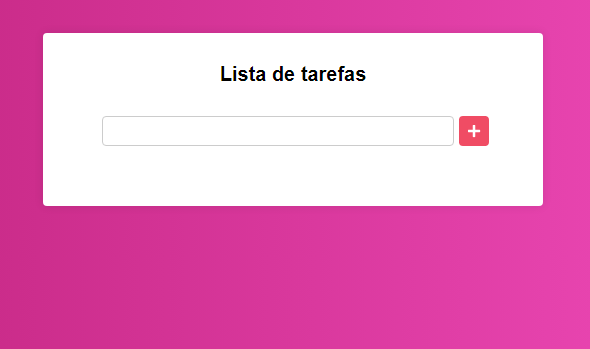
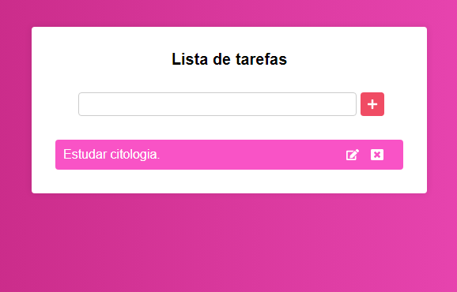

<h1 align="center">Lista de Tarefas</h1>
<h2 align="center">Guie-se por aqui!</h2>

 
Objetivo: Este projeto foi criado inteiramente em React com intuito de treinar os conteúdos adquiridos em um curso. 

 
Tecnologias: 
   <h4>
    <a href="https://pt-br.reactjs.org/">• React</a>
  </h4>
 

 
Funções: 
   <ul>
     <li>Adicionar tarefas</li>
     <li>Editar tarefas</li>
     <li>Deletar tarefas</li>
     <li>Listar tarefas</li>
   </ul>
 

 
Utilização
   <ul>
     <li>Para utilizar basta clonar em sua máquina e rodar um npm i na pasta do projeto.</li>
     <li>Comece com npm start.</li>
   </ul>
 

 
Capturas de tela
 <h1 align="center">
  
 </h1>
 <h1 align="center">
  
 </h1>
 

